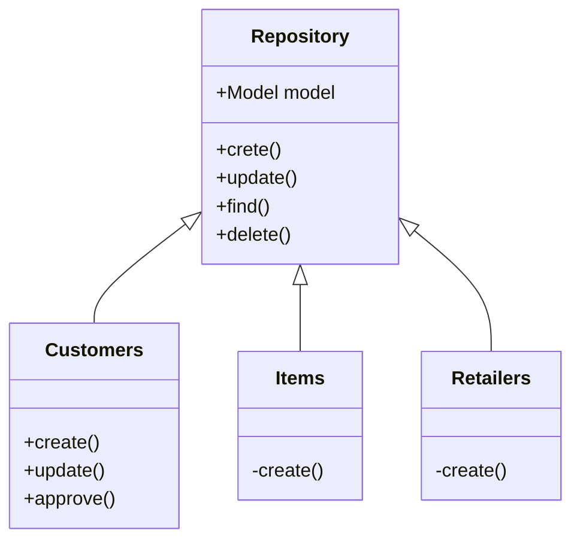
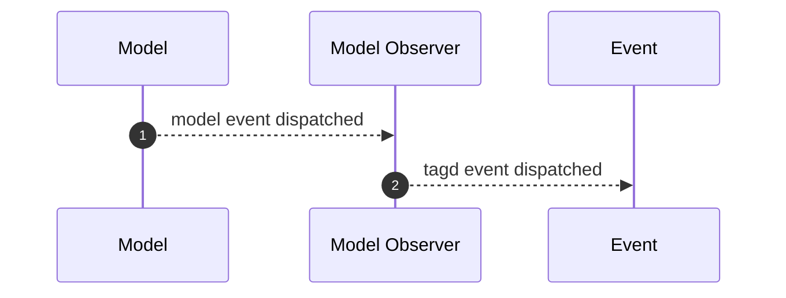

# Tagd Core Laravel package

## What it does

This [Laravel](https://laravel.com) package allows you to manage all things related with Tagd

Once installed you can do stuff like this:

```
public function doSomething(\Tagd\Core\Repositories\Items $items)
{
    $item = $items->findById('123');
}
```

For further reading please check [doc/index.md](doc/index.md)

### Changelog

Please see [CHANGELOG](CHANGELOG.md) for more information what has changed recently.

## Getting Started

To get a local copy up and running follow these simple example steps.

### Installation

1. Add the package to your project with
```
composer require tagd/core
```

2. Publish the package configuration file with
```
php artisan vendor:publish --provider="Tagd\Core\Providers\TagdServiceProvider"
```
Then edit the `/config/tagd.php` in your project.

3. This package requires a few [migrations](src/database/migrations) and [seeds](src/database/seeds).
Run the artisan commands if needed:
```
php artisan migrate
php artisan db:seed --class="Tagd\Core\Database\Seeders\DatabaseSeeder"

> For development purposes you can run the following seeder
`php artisan db:seed --class="Tagd\Core\Database\Seeders\DevSeeder"`
```

## Usage

Here is a list of different features this package provides:
### Commands

There are several artisan console commands available at [Console/Commands](src/code/Console/Commands). Once the package is installed you can run these commands in your project.

| Command                   | Description                                                     |
|---------------------------|-----------------------------------------------------------------|
| `tagd:seed:db`            | Seeds the database                                              |
| `tagd:seed:dev`           | Seeds the database for development                              |
| `tagd:seed:qa`            | Seeds the database for QA                                       |
| `tagd:seed:uat`           | Seeds the database for UAT                                      |
| `tagd:seed:prod`          | Seeds the database for production                               |

> If you add more commands, remember to register them at [Providers/TagdServiceProvider.php](src/code/Providers/TagdServiceProvider.php)

### Models

There are models available at [Models](src/code/Models). These are just plain Eloquent models.

These models purpose is only to deal with the database tables. Any extra logic is handled by a Repository.

To configure which database connection the models will use, update the `config/tagd.php` file in your project.

### Repositories

There are repositories available at [Repositories](src/code/Repositories). The main purpose of these repositories are to provide users with access to the different Tagd entities.

You can think of a repository as an intermediate class to deal with the Eloquent models so you don't have to, but it also encapsulates any business logic related to that model life cycle.

Repositories inherit from a base class which implement all the basic CRUD actions. Each repository can override those actions or implement extra actions.



Each repository has an interface so it can be binded in Laravel. Read more at the [Service Container](https://laravel.com/docs/9.x/container) documentation.

### Events

There are events available at [Events](src/code/Events).

| Event | Description |
|---------------------------|-----------------------|
| `ItemCreated`            | An item has been created             |
|   |   |

These events are dispatched mostly by the repositories. But also from model observers. The purpose of these events are to serve repository users with a way to interact on tagd events so they don't have to interact with model events directly.



### Listeners

There are events available at [Listeners](src/code/Listeners). The listeners are subscribed to the different events and perform actions depending on the logic.

This package performs some actions on certain events (i.e. send an email when a transaction has been made).

### Policies

There are auth policies available at [Policies](src/code/Policies). These policies define what permissions authed users have against the different operations when applied to a model.

Check [Authorization](https://laravel.com/docs/8.x/authorization) at Laravel's documentation.

i.e. the following code defines that an authed `$user` is able to `update` only his/her items(s). (Given that the authed user is the owner)
```php
    public function update(GenericUser $user, Item $item)
    {
        return intval($user->id) === intval($item->owner_id)
            ? Response::allow()
            : Response::deny('You do not own this item');
    }
```

The policies are mostly used inside the [Repositories](src/code/Repositories) but they can be accessed from anywhere.

i.e. the following code uses the previously defined policy to authorize an user before updating a conference
```php
    public function update(int $itemId, array $payload): bool
    {
        try {
            $item = $this->findById($itemId);

            $this->authorize('update', $item);

            $item = $item->update($payload);
        } catch (\Illuminate\Auth\AuthenticationException) {
            throw new Exceptions\NotAllowed($e);
        } catch (\Exception $e) {
            throw new Exceptions\NotFound($e);
        }

        return $item;
    }
```

### Uploads

Files are stored in S3. Each uploaded file is represented by the [Upload](src/code/Models/Upload.php) class.

You need to setup the right credentials in the [config](src/config/tagd.php) file. This model is able to generate a pre-signed url for anyone to store the file in S3 in our behalf. Please note that these url expire after some period of time.

## Development

TO DO
### Publish

Should you need to publish a new version of this package, follow these steps:

1. Push your changes to the `main` branch

2. Update the [CHANGELOG.md](CHANGELOG.md) to document what's new in this new version

3. Tag your `main` branch with your new version number, i.e. `1.0.2` and wait for the package to be published.

> Please note that before publishing the package a number of tests will be run, including code style. If any test fails the package won't be published.

See [.gitlab-ci.yml](.gitlab-ci.yml) for further details.

The package will be published at this project's [package registry](https://gitlab.totallydev.com/tagd/core/-/packages)

### Tests

There are a number of tests available at [tests](tests) classified as Feature and Unit tests.

You can perform the tests by running `composer run test`.

### Code Style

This project follows a coding standard based on the [PSR-12](https://www.php-fig.org/psr/psr-12/) standard and customized for [Laravel](https://laravel.com/) project.

You can perform a check on code style by running `composer run pint_check`.

Should you want to also fix automatically the code style, you can run `composer run pint`

Read more at the [Pint](https://github.com/laravel/pint) project.

### Tech Stack

This package follows the standard conventions for Laravel Packages. Please read the official [Package development](https://laravel.com/docs/9.x/packages) documentation for further details.

The dependencies of this package are defined in the [composer.json](composer.json) file. The main ones are:

- [PHP 8.1](https://www.php.net/) scripting language.
- [AWS SDK 3.2](https://aws.amazon.com/sdk-for-php/) PHP library to communicate with AWS.
- [PHPUnit 9.3](https://phpunit.de/) PHP testing framework.

> Please read the official [Composer](https://getcomposer.org/doc/) documentation for further details.
